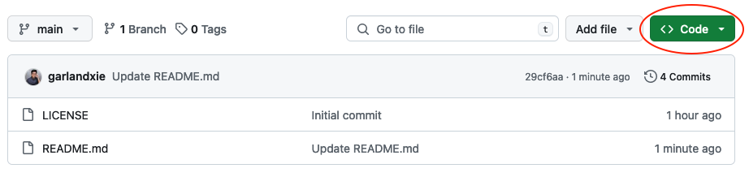
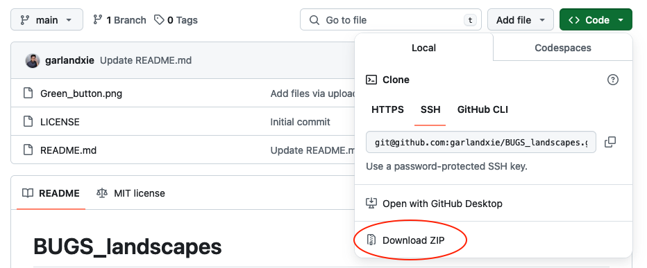
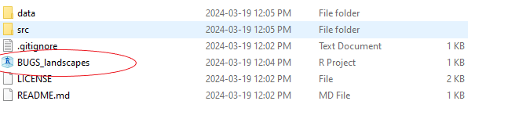
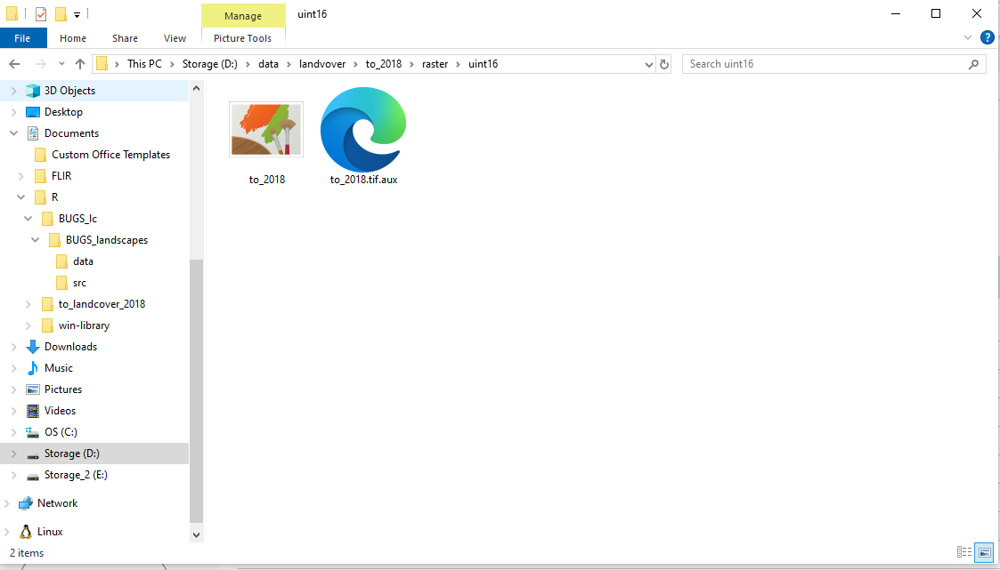

# BUGS_landscapes
Purpose: calculating urban landscape metrics for researchers in the [Biodiversity of Urban Green Spaces lab](https://www.macivorlab.ca/) at the University of Toronto

# Steps to use the R scripts (the easy way)
1. For personal use on your computer (Mac and Windows), you can download the entire workflow (R scripts and R project) by first clicking on the Code button (green).

2. Then click on the "Download ZIP" under the Local tab. Afterwards, unzip the folder under a specific directory on your computer (e.g., Documents). For unzipping files, your computer should have a default application to perform this task ([guide for Mac](https://support.apple.com/en-ca/guide/mac-help/mchlp2528/mac), [guide for Windows](https://www.pcworld.com/article/394871/how-to-unzip-files-in-windows-10.html)).

3. In your specified directory, click on the blue "R Project" icon to launch a new project in RStudio. This should load all the R scripts required to calculate the landscape metrics for your sites with specific latitude and longitude.

4. **Important note:** You need the raster file for the 2018 Toronto and Forest Land Cover dataset (file size: 6.69 GB) to calculate the landscape metrics. Due to file storage limits, this file is not available with this GitHub repository. If you have access to the BUGS lab computer, the file-path for the raster (to_2018.TIF) is: **This PC > Storage (D:) > data > landvover > to_2018 > raster > uint16 > to_2018.TIF.**

This file-path should be available for all accounts on the BUGS lab computer (if not, please consult [J. Scott MacIvor](https://www.utsc.utoronto.ca/biosci/scott-macivor)). Here, there are two options for your workflow are: (1) run the R scripts on your local account on the BUGS lab computer with the raster file on file or (2) move the raster file over to your personal computer and then run the R scripts. 
